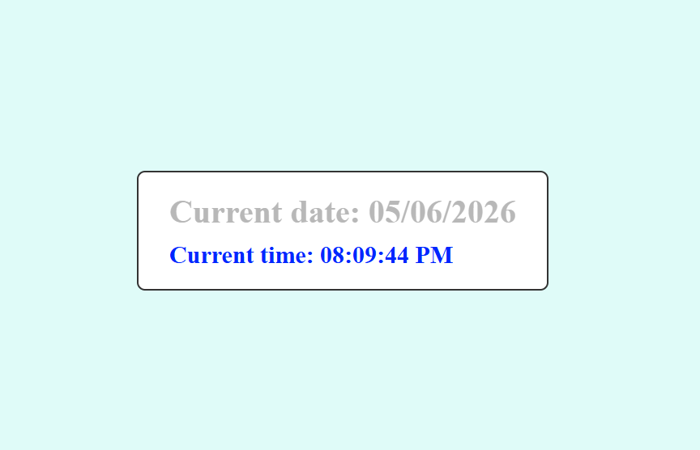

# color-clock-with-React-and-npm

This is a simple real-time clock application built using React and
Vite.\
It displays the current date and time and updates automatically every
second.

------------------------------------------------------------------------

## Features

-   Displays the current date
-   Displays the current time (updates every second)
-   Uses date-fns for formatting
-   Styled with a centered layout using Flexbox

------------------------------------------------------------------------

## Technologies Used

-   React
-   Vite
-   date-fns
-   CSS

------------------------------------------------------------------------

## How to Run the Project

Follow these steps to run the project locally:

1.  Clone the repository: git clone
    https://github.com/Matt20Swanberg/color-clock-with-React-and-npm

2.  Navigate into the project folder: cd color-clock-with-React-and-npm

3.  Install dependencies: npm install

4.  Start the development server: npm run dev

5.  Open your browser and go to: http://localhost:5173

------------------------------------------------------------------------

## How It Works

### State Management

const \[clockText, setClockText\] = useState(new Date())

### Updating the Time

useEffect(() =\> { const intervalId = setInterval(() =\> {
setClockText(new Date()) }, 1000)

return () =\> clearInterval(intervalId) }, \[\])

### Formatting

format(clockText, 'MM/dd/yyyy') format(clockText, 'hh:mm:ss a')

------------------------------------------------------------------------

## Notes

-   The interval is cleaned up using clearInterval to prevent memory
    leaks.
-   The app keeps a single Date object and formats it for display.

------------------------------------------------------------------------

## Screenshots

------------------------------------------------------------------------

## Author
Matthew Swanberg

------------------------------------------------------------------------

## License
This project is for course 4 module 1.